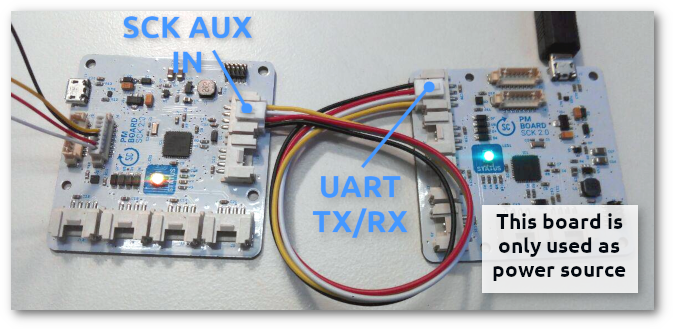
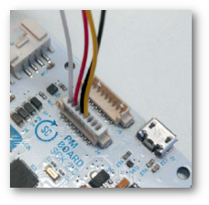

# Test firmware

## 1. Burn the bootloader

This board is compatible with [Arduino zero bootloader](https://github.com/arduino/ArduinoCore-samd/tree/master/bootloaders/zero). The bootloader can be uploaded with and [Atmel ICE](https://www.microchip.com/DevelopmentTools/ProductDetails.aspx?PartNO=ATATMEL-ICE) programmer or with a Raspberry pi computer (here are some [notes](https://hackmd.io/_zWIF3lpT9u82JZmDTz0qA?both#Uploading-Arduino-original-bootloader) on the required setup). You will also need the [Arduino IDE](https://www.arduino.cc/en/Main/Software) or [OpenOCD](http://openocd.org/) software to upload it.
Arduino already provide a binary compiled file [samd21_sam_ba.bin](https://github.com/arduino/ArduinoCore-samd/blob/master/bootloaders/zero/samd21_sam_ba.bin) so there is no need to build the source code.

## 2. Build and upload the _Test Firmware_

* Install [Platformio](http://platformio.org/).
* Get the code: `git clone https://github.com/fablabbcn/smartcitizen-kit-pm-board`
* Connect the PM board via _USB_
* Go to the _test_firmware_ folder: `cd smartcitizen-kit-pm-board/test_firmware`
* Build and upload the test firmware: `platformio run -t upload`

## 3. Test flow

* Connect the Plantower **PM sensor** to **connector A**

	

* Connect the board via **SCK AUX IN** grove connector with a **3.3v** power source.  
Another board from the same type can be used connecting it to USB power and using the **UART TX/RX** to provide the 3.3v to the tested board.

	

* The led will **cycle** between **red/green/blue** colors.   
* The led will be **red** while searching for PM sensors on connectors _PMS_A_ or _PMS_B_ :red_circle:
* When the PM sensor is found the led will change to **pink** 
* Change the PM sensor from connector **A** to connector **B**

    

* When new PM sensor is found the led will turn **green** and the test is **finished.** 
